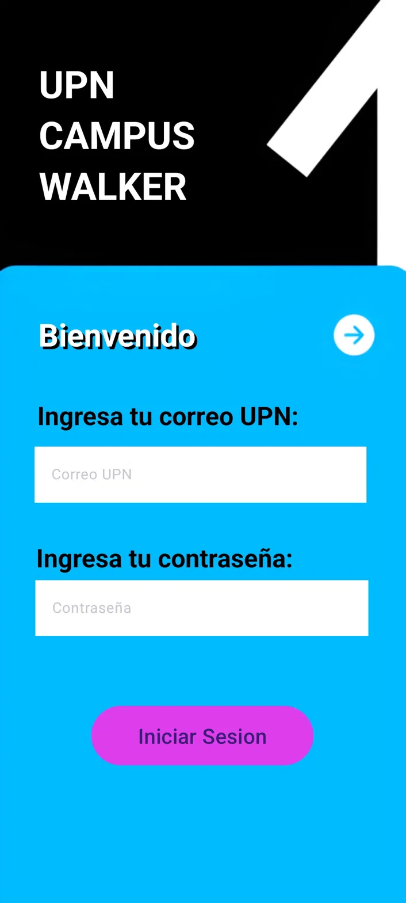
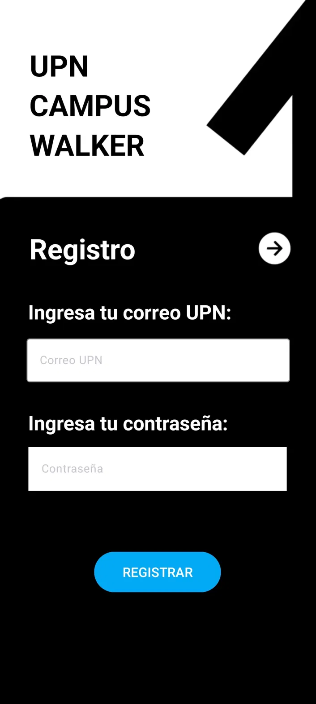
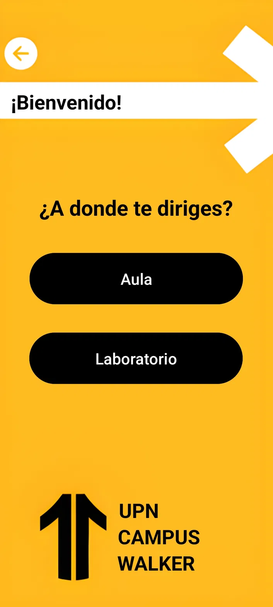
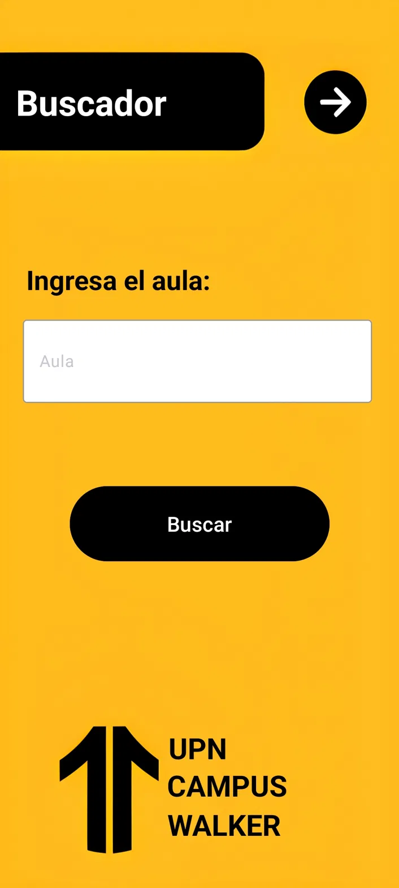
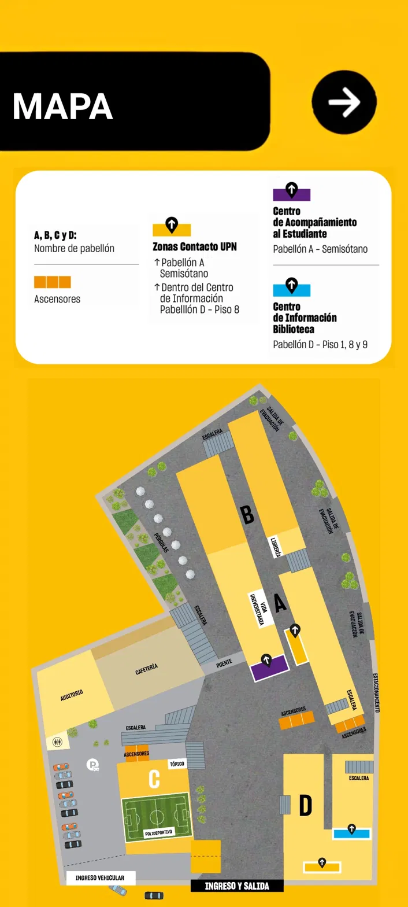
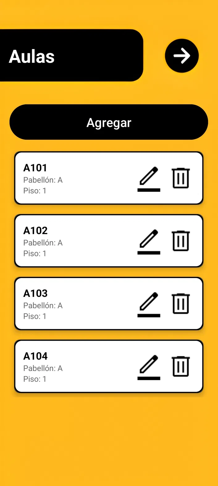
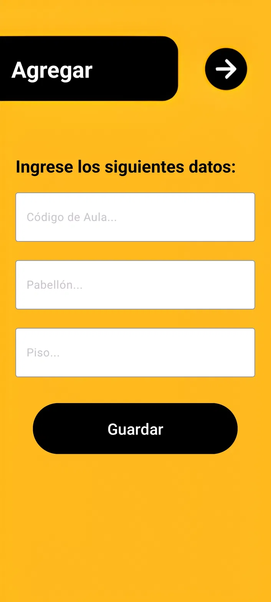

# UPN Campus Walker 🧭

Aplicación móvil nativa (Android) para mejorar la orientación de estudiantes dentro del campus de la **Universidad Privada del Norte (UPN), sede Breña**. Permite ubicar aulas y laboratorios por código, ver su información (pabellón, piso) y visualizar su ubicación en un mapa interactivo del campus.

## 📱 Funcionalidades

- **Autenticación**: registro e inicio de sesión de usuarios
- **Buscador de aulas y laboratorios**: ingresa el código y obtén pabellón, piso y ubicación
- **Mapa interactivo del campus**: visualización de pabellones (A, B, C, D), ascensores, escaleras, zonas de contacto UPN y puntos de interés
- **Panel de administración**: CRUD completo (crear, editar, eliminar) de aulas y laboratorios, protegido con login de administrador

## 🛠️ Stack técnico

- **Lenguaje**: Kotlin
- **IDE**: Android Studio
- **Base de datos**: SQLite (local, vía `DBHelper`)
- **Arquitectura**: Activities + Adapters (RecyclerView) para listados de aulas/laboratorios

## 📂 Estructura del proyecto

```
app/src/main/java/com/jdca/proyectofinal/
├── UI_Login/              # Login, registro y pantalla principal
├── UI_Buscadores/         # Buscador de aulas/labs, info detallada y mapa
├── AdminAulasLabs/        # Panel admin: CRUD de aulas y laboratorios
├── DB/                    # DBHelper (SQLite)
└── Model/                 # Modelos: Aula, Laboratorio
```

## 📸 Capturas de pantalla

### Autenticación
| Login | Registro |
|---|---|
|  |  |

### Búsqueda de aulas y mapa
| Menú principal | Info de aula | Mapa interactivo |
|---|---|---|
|  |  |  |

### Panel de administración
| Listado de aulas (CRUD) | Agregar aula |
|---|---|
|  |  |

## 🚀 Cómo ejecutar el proyecto

1. Clona este repositorio
2. Ábrelo en Android Studio (`File → Open`)
3. Espera a que Gradle sincronice
4. Conecta un dispositivo Android (con depuración USB activada) o usa un emulador
5. Ejecuta con el botón ▶️ Run

**Acceso de administrador** (para probar el panel CRUD):
- Usuario: `Admin`
- Contraseña: `admin`

## 💡 Contexto del proyecto

Este proyecto nació de una necesidad real: la dificultad para ubicar aulas y laboratorios dentro del campus UPN Breña, especialmente para estudiantes nuevos. La app resuelve esto con un buscador rápido por código y un mapa visual del campus.

## 👤 Autor

**Juan Diego Constantino** — Estudiante de Ingeniería de Sistemas, UPN
[GitHub](https://github.com/Juandi1602) | [LinkedIn](https://www.linkedin.com/in/juan-diego-constantino-8571b5344/)
